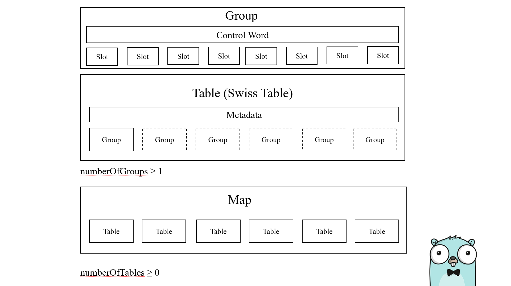
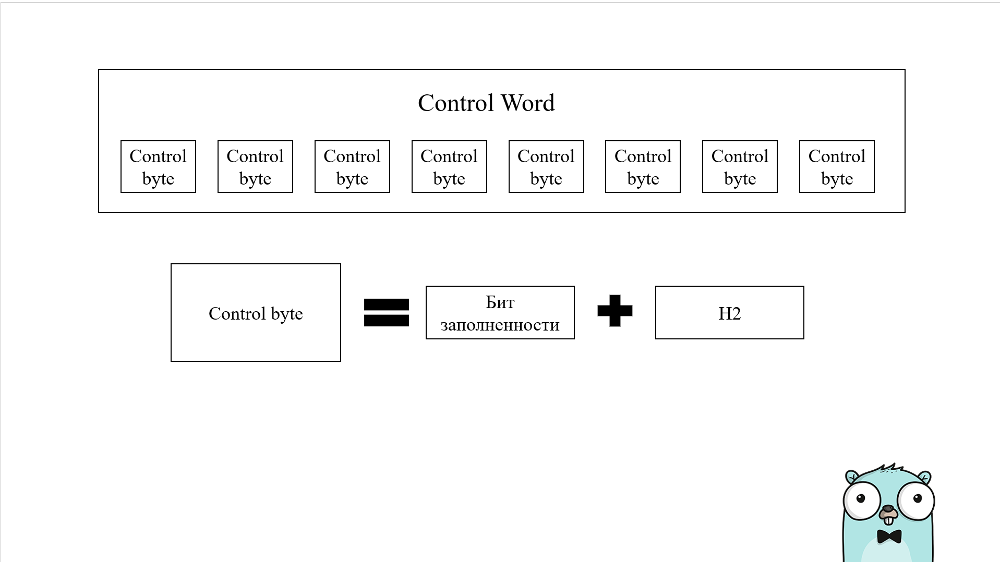
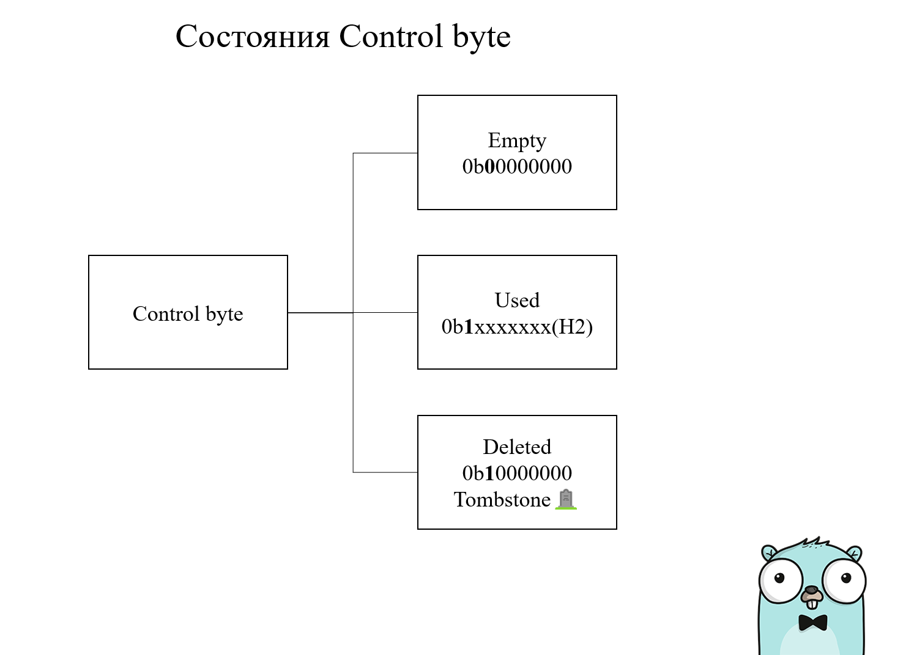
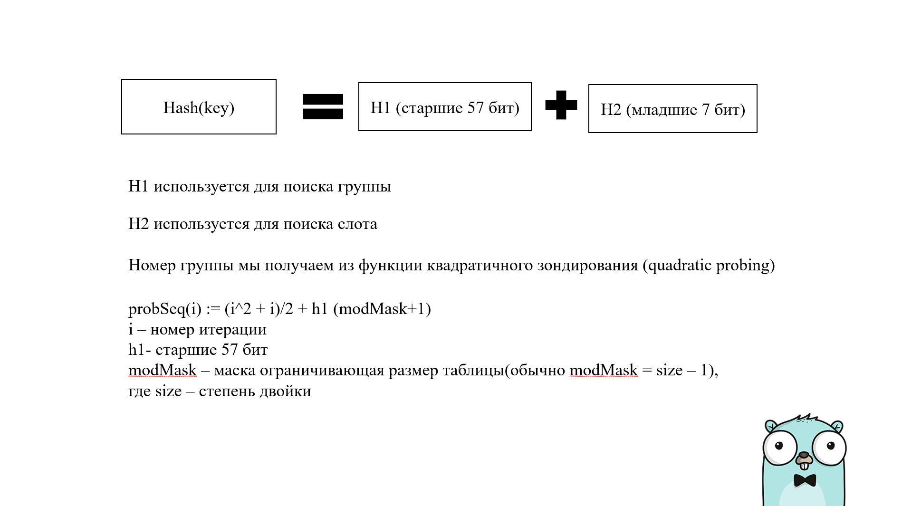
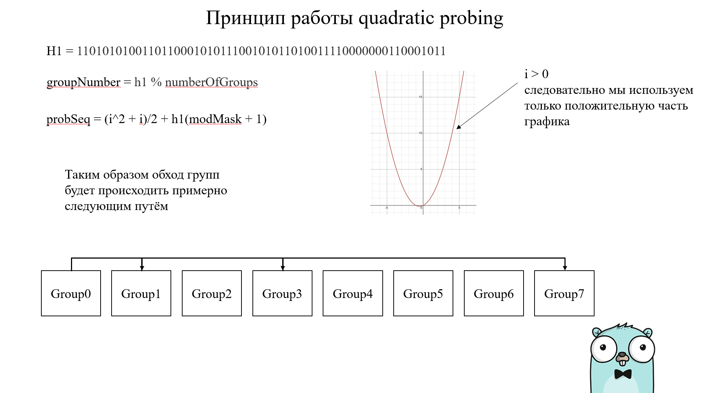
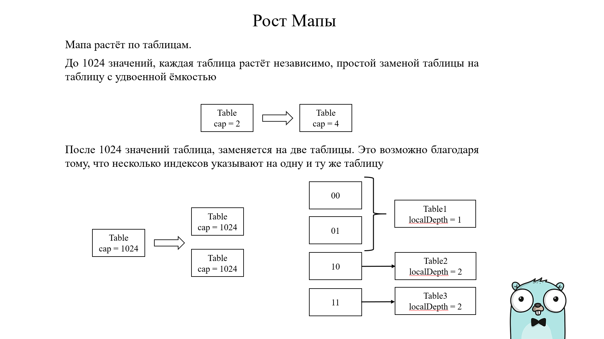

# Терминология

- Слот (Slot) - хранили пары ключ-значение
- Группа (Group) - Группа из 8-и слотов + контрольное слово
- Контрольное слово (Control word) - 8-ми байтное слово. Каждый байт которого представляет контрольный байт слота.
- Контрольный байт(Control byte) - 8-и битное число, которое состоит из 7 бит хэша и 1 бита заполненности, который говорит нам, о том, что слот заполнен, пуст или удалён.
- H1 - Старшие 57 бит хэша.
- H2 - Младшие 7 бит хэша.
- Таблица - Полная реализация хэш таблицы - "Swiss Table". Таблица состоит из одной или более групп для хранения слотов + метаданные для осуществления операций с таблицей и определения момента, когда необходимо расширять мапу.
- Мапа (Map) - Верхне-уровневый тип Map состоящий из нуля или более таблиц.
  Старшие биты определяют, какой таблице принадлежит хэш.
- Хранилище(Directory) - Массив таблиц, используемых мапой (Map)





Важно понимать, что каждый слот не содержит в себе контрольный байт, но связан с ним через контрольное слово.

Наличие бита заполненности вводит такие понятия, как состояние слота:
- Используется (Used)
- Пуст(Empty)
- Удалён(Deleted = Tombstone 🪦)



Понимание этих состояний понадобиться при разборе алгоритма поиска, вставки и удаления из мапы.

# SIMD инструкции

Эта технология используется для поиска слота по хэшу внутри группы. Основная её мощь в том, что теперь мы можем не перебирать каждый слот в группе, а применить операцию сравнения полученного хэша(H2) одновременно ко всем 8-и слотам группы за одну операцию.

Статья на [википедии](https://en.wikipedia.org/wiki/Single_instruction,_multiple_data) про SIMD

# Cплит хэша



Представим, что мы получили hash:
```
h = 0xABCDEF1234
```

Преобразуем в двоичную форму
```
0xABCDEF1234 = 1010101111001101111011110001001000110100
```

```
H2 = 101010 (первые 7 бит)
H1 = 111001101111011110001001000110100 (оставшиеся 57 бит)
```

Можете поиграться в cmd/hash_split.go (получить довольно легко H1 и H2 c помощью побитового сдвига).

А вот реализация получения h1 и h2 из исходников.
```go
func h1(h uintptr) uintptr {
	return h >> 7
}
```
```go
func h2(h uintptr) uintptr {
	return h & 0x7f
}
```

# Поиск группы. Квадратичное зондирование (Quadratic probing)

О том, что такое квадратичное зондирование, можно почитать в той же [википедии](https://en.wikipedia.org/wiki/Quadratic_probing) Основная его суть (нам для понимания) - когда мы осуществляем поиск, вставку или удаление элемента из хэш таблицы - мы проходим не по всем таблицам, а только по тем, которые получили из функции квадратичного поиска:

`p(i) := (i^2 + i)/2 + hash (mod mask+1)`



Функция квадратичного зондирования возвращает нам номера групп, которые мы будем обходить, в зависимости от полученного хэша.

Обратите **внимание**, что при поиске слота мы работаем не с **таблицами** а с **массивом групп**.

Использование квадратичного поиска вводит нам важные ограничения - число групп должно быть степенью 2, последняя группа в квадратичном поиске должна быть пуста. (Таблица не может быть заполнена на 100%).

Её реализацию можно посмотреть [тут](https://cs.opensource.google/go/go/+/release-branch.go1.24:src/internal/runtime/maps/table.go) -> probeSeq
# Как работает алгоритм поиска, вставки, удаления

H1 - используется для поиска группы, H2 - для получения конкретного слота в группе.
## Поиск

После того, как мы получили H1 - формируется квадратичная последовательность(probeSeq). Мы проходим по всем индексам групп, полученным из probeSeq (то есть мы проходим не по всем группам, а только по тем, что получили из probSeq) и сравниваем H2 со всеми контрольными байтами группы до тех пор пока не находим нужный или пустой слот.

- Если слот имеет статус Deleted(tomstone 🪦), он игнорируется, если найден пустой слот(Empty), это означает, что больше элементов в группе нет и поиск заканчивается.
- Если найден контрольный байт с таким же H2, то осуществляется процесс полного сравнения найденного ключа с переданным ключом.
- В случае успешного сравнения - возвращается соответствующее ключу значение.
- В случае провала, возвращается значение по умолчанию.
## Вставка

Алгоритм вставки идентичен алгоритму поиска, но с некоторыми дополнениями.
- В случае успешного сравнения H2, соответствующее ключу значение переписывается на новое.
- Если найден слот в статусе Delted(tombstone). Данный слот запомниается, как возможное место для вставки, но поиск продолжается, чтобы убедиться, что ключ отсутствует.
- Если найден слот в статусе Empty, то при наличии tombstone, мы записываем новое значение в слот tobstone, а при его отсутствии в слот со статусом Empty.
## Удаление

При удалении в полной группе слот не отмечается, как пустой, так как при проверке на пустой слот мы на нём остановимся, в то время, как у нас могут быть не пустые слоты в следующих группах. Такие слоты помечаются, как tombstone 🪦(надгробие).  При удалении из не полной группы, слот помечется сразу, как пустой.  Надгробия очищаются полностью, только во время роста.

# Рост мапы

Последовательность зондирования зависит от количества групп. Таким образом, при увеличении количества групп все слоты должны быть переупорядочены, чтобы соответствовать новой последовательности зондов. Другими словами, вся таблица должна быть увеличена сразу.

Для поддержки инкрементального роста мапа разделяет свое содержимое на несколько таблиц. Каждая таблица по-прежнему является полной хэш-таблицей, но отдельная таблица может обслуживать только подмножество хэш-пространства. Рост происходит на отдельных таблицах, поэтому, хотя вся таблица должна расти сразу, каждый из этих ростов является лишь небольшой частью мапы. Максимальный размер одного роста ограничен ограничением максимального размера таблицы до ее разделения на несколько таблиц.

Мапа начинается с одной таблицы. До 1024 рост просто заменяет эту таблицу заменой с двойной емкостью. За пределами этого предела рост разделяет таблицу на две.

Мапа использует "extensible hashing", чтобы выбрать, какую таблицу использовать. Массив таблиц образует директорию("Directory"). Мы используем не весь хэш а лишь верхние биты хэша, как индекс таблицы. Число используемых бит растёт по мере увеличения числа таблиц. Например у нас всего одна таблица, мы используем 0 бит хэша. Когда у нас две таблицы, мы используем 1 бит хэша. Map.GlobalDepth - это число бит, используемых в текущий момент для выбора таблицы. 

Стоит отметить, что каждая таблица растёт независимо. Они имеют свой load factor. Если первая таблица растёт, она разделяется. Нам уже нужно два бита для выбора таблицы и таким образом мы имеем три таблицы а не 4-е. Мы поддерживаем это, позволяя нескольким индексам указывать на одну и ту же таблицу. 



Таблицы отслеживают локальную глубину localDept.  Необходимо увеличивать directory при разделении таблицы (localDepth == globalDepth)

# Проблемы старой мапы

До Go 1.24 карты работали следующим образом:

- Бакеты: ключи хранились в `бакетах` (группах по 8 записей).

- Цепочки переполнения: если бакет заполнялся, новые записи попадали в бакеты `переполнения`, связанные как цепочка.

- High order bits: у каждой записи был крошечный `tophash` (8 бит хеша ключа), чтобы быстро пропускать несовпадающие ключи.

- Проверка HOB происходила по каждой паре ключ-значение последовательно

Это работало, но имело некоторые шероховатости:

- Медленный поиск: сканирование цепочек переполнения означало прыжки в памяти (привет, промахи кэша!).

- Раздувание памяти: бакеты переполнения съедали дополнительное пространство.

- Проблемы с изменением размера: увеличение карты означало перехеширование всего. Ой.

# Преимущества новой мапы

Подытожим преимущества новой map в Go 1.24, основанной на Swiss Table:

- **Быстрое отсеивание** позволяет отбрасывать неподходящие слоты без обращения к ключам.
    
- **Полное сравнение ключей** гарантирует корректное разрешение коллизий при совпадении H2.
    
- **Использование tombstone** позволяет пере использовать удалённые слоты
    
- **Квадратичное зондирование** минимизирует количество проходимых групп и ускоряет поиск и вставку элементов
    

Эти методы наряду с другими улучшениями делают map более эффективным и производительным:

- **Улучшенная локальность данных** — группировка слотов и контрольные слова сокращают количество кеш-промахов.
    
- **Быстрый поиск** — SIMD-оптимизации позволяют сравнивать сразу 8 кандидатов на соответствие.
    
- **Гибкое расширение** — постепенный рост через **split** и **directory doubling**, а также разделение на подтаблицы после 1024 групп снижает накладные расходы на перераспределение.
# Источники

Исходники [мапы](https://cs.opensource.google/go/go/+/release-branch.go1.24:src/internal/runtime/maps/map.go)

Исходники квадратичного зондирования (probeSeq) [поиска](https://cs.opensource.google/go/go/+/release-branch.go1.24:src/internal/runtime/maps/table.go)

Статья на [хабре](https://habr.com/ru/companies/simbirsoft/articles/899180/), с косяком, про группы для обхода. Используется не линейное зондирование("линейный пробинг", как он назван в статье), а квадратичный.