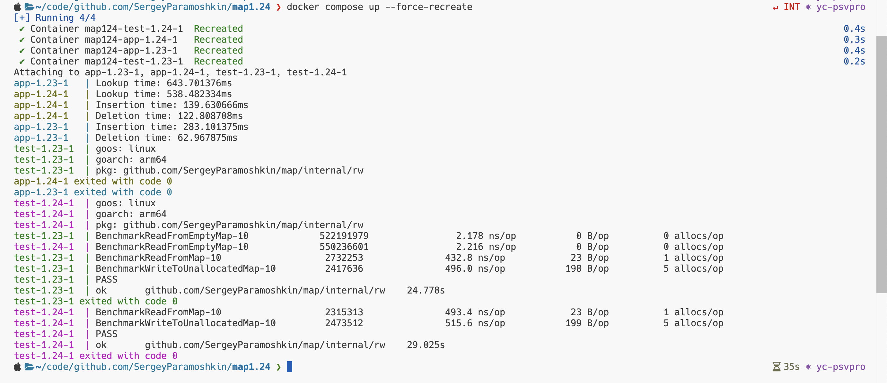

# что такое SwissTable

SwissTable — это высокопроизводительная реализация хэш-таблицы, разработанная Google. Она используется в библиотеке [Abseil](https://abseil.io/about/design/swisstables) (C++ библиотека с открытым исходным кодом) и оптимизирована для работы в многопоточных средах. SwissTable сочетает в себе высокую скорость работы и низкие накладные расходы на память.

## Основные особенности SwissTable

### Использование SIMD-инструкций

SwissTable использует SIMD (Single Instruction, Multiple Data) инструкции для параллельной обработки данных. Это позволяет эффективно проверять наличие элементов в таблице, что особенно полезно для операций поиска.

### Метаданные в отдельном массиве

В отличие от традиционных хэш-таблиц, где метаданные (например, флаги занятости ячеек) хранятся вместе с данными, SwissTable хранит метаданные в отдельном массиве. Это улучшает производительность за счет лучшей локализации данных.

### cache-friendly

SwissTable оптимизирована для эффективного использования кэша процессора, что делает её быстрой даже на больших объемах данных.

### Открытая адресация с квадратичным probing

SwissTable использует открытую адресацию (open addressing) для разрешения коллизий, а именно квадратичный probing (квадратичное исследование), что помогает равномерно распределять элементы по таблице.

### Гибкость и производительность

SwissTable поддерживает различные типы ключей и значений, а также обеспечивает высокую производительность как для вставки, так и для поиска.

# Подробный разбор Swiss Table

## Шаг 1: Разделение хэша (H1 и H2)

```H2 (7 бит): Первые 7 бит хэша. Это своего рода "мини-отпечаток" ключа.```

H2 = первые 7 бит от 0x5F4A3B2C1D → 0x5F (в двоичном виде: 01011111).

```H1 (57 бит): Оставшиеся биты. Они определяют, к какой группе принадлежит ключ.```

H1 = остальные биты → используются для вычисления индекса группы.

## Шаг 2: Метаданные

Каждая запись в карте имеет поле метаданных размером 1 байт. Этот байт хранит:

7-битное значение H2.
1-битный флаг статуса:

0: Пусто.
1: Занято.

0x80 (в двоичном виде 10000000): "Tombstone"

## Шаг 3: Поиск группы с помощью H1

```
group_index = H1 % number_of_groups
```

## Шаг 4: Обработка коллизий (без связных списков!)

Если Группа заполнена, происходит следующее:

Линейное пробирование (Linear Probing):
runtime проверяет следующую группу, пока не найдет свободный слот.

Tombstones: Если слот помечен как удаленный, он считается свободным для вставки, но сохраняется для поиска.

Почему это круто:

Нет необходимости в связных списках — все данные хранятся в непрерывной памяти.

Кэш процессора работает эффективнее (меньше промахов кэша!).

## Пример пошагово

- Вставка:

Хэш: data → H = 0x5F4A3B2C1D.

- Разделение:

H2 = 0x5F → сохраняется в метаданных.
H1 → вычисляет индекс группы (например, Группа 3).

- Проверка Группы:

Если Слот A в Группе X свободен → вставляем туда.
Если Слот A занят, проверяем Слот B, затем Слот C и т.д.

Коллизия? Если Группа X заполнена, переходим к Группе Y.

- Поиск:

Вычисляем H2 = 0x5F.
Переходим к группе, вычисленной по H1.
Сканируем метаданные группы в поиске 0x5F.
Если найдено совпадение: сравниваем фактический ключ (для обработки хэш-коллизий).
Если совпадения нет: переходим к следующей группе.
Этот подход позволяет пропустить 99% неподходящих ключей, даже не проверяя их!

## Почему Swiss Table лучше старой карты

| Старая map                               | Swiss Table                                        |
| ---------------------------------------- | -------------------------------------------------- |
| Использовала связные списки для коллизий | Использует линейное пробирование (без указателей!) |
| Сканировала ключи по одному              | Метаданные мгновенно отсеивают несовпадения        |
| Переполненные блоки тратили память       | Tombstones эффективно переиспользуют пространство  |

# Примеры



# источники

<https://www.bytesizego.com/blog/go-124-swiss-table-maps>

<https://dev.to/tuna99/go-124-and-the-swiss-table-revolution-a-new-era-for-maps-1pdj>

<https://medium.com/@erenberik0/go-1-24-how-did-they-improve-maps-with-swiss-table-and-how-does-it-work-f2aea9498c5d#:~:text=The%20Swiss%20Table%20is%20a,misses%20and%20improves%20lookup%20speeds>.

<https://cs.opensource.google/go/go/+/master:src/internal/runtime/maps/table.go?q=Occupied&ss=go%2Fgo:src%2Finternal%2Fruntime%2F>
